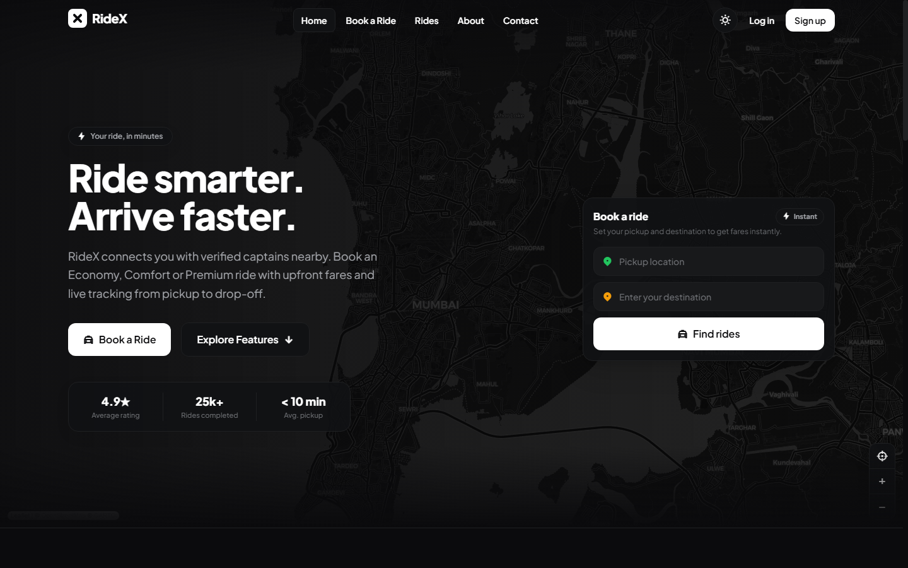
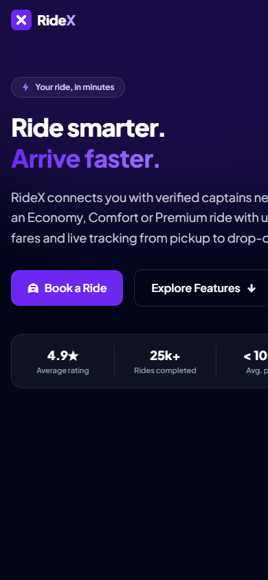
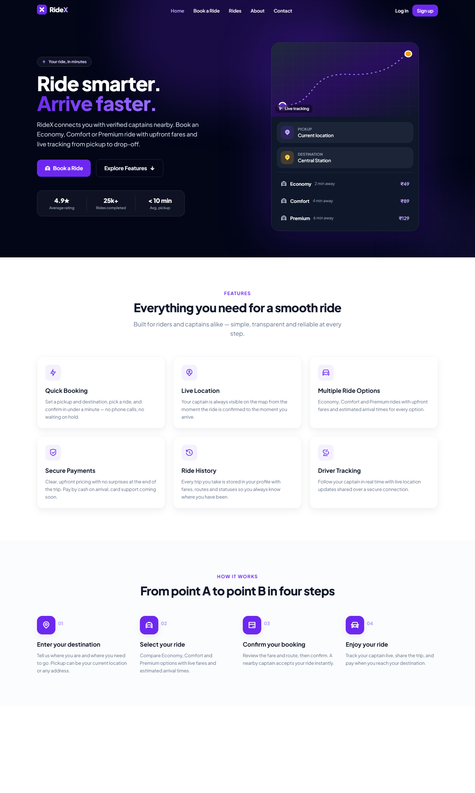
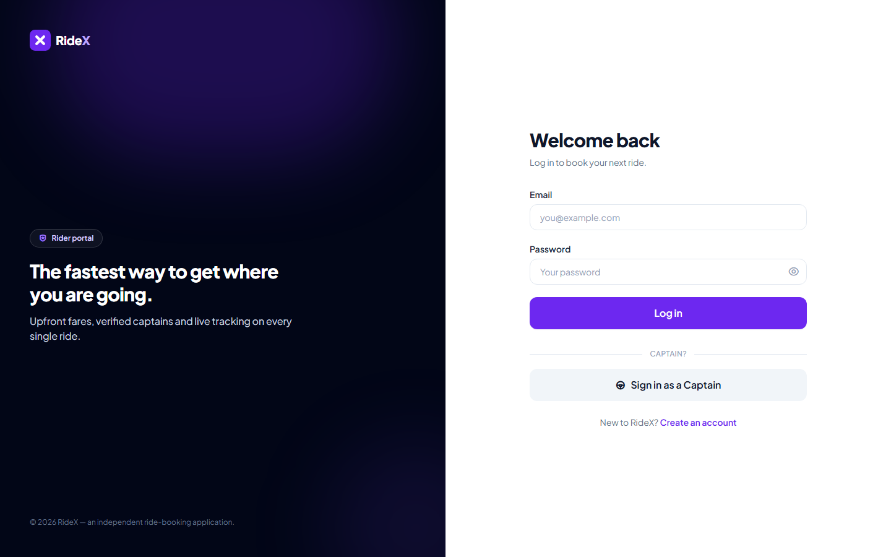
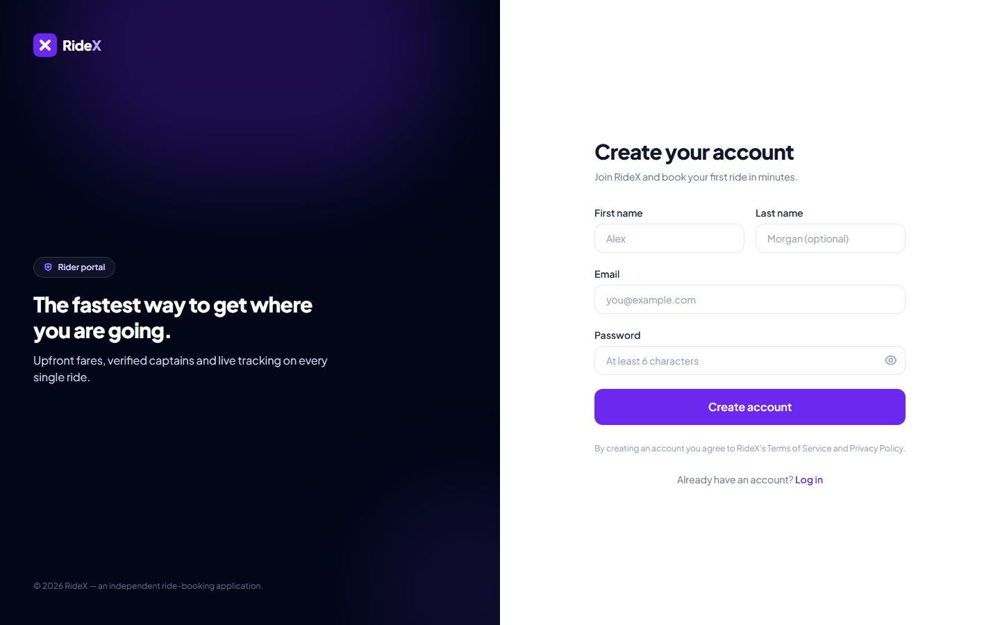
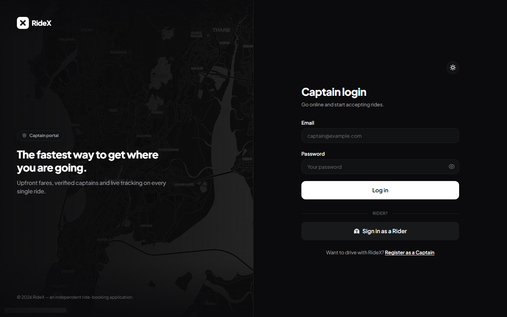
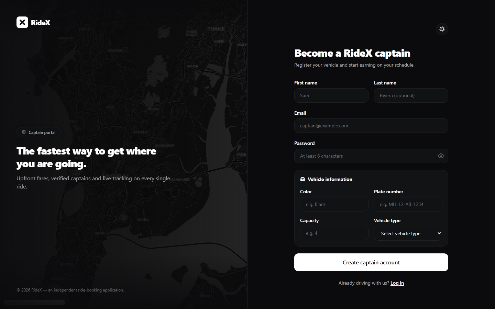

# 🚗 RideX

RideX is a full-stack, real-time ride-booking application — a substantially customized Uber-style
clone with its own visual identity, UI system and documentation. Riders book Economy, Comfort or
Premium rides with upfront fares; captains go online, receive ride requests in real time and
complete trips with OTP-verified starts.

> RideX is an independent project and is **not affiliated with Uber**. No Uber branding or assets
> are used.

---

## Features

- **Real-time ride booking** — riders create a ride and nearby online captains are notified
  instantly over Socket.io (no polling).
- **Dual portals** — separate rider and captain accounts, dashboards and ride flows.
- **Ride lifecycle** — `pending → accepted → ongoing → completed`, with a 6-digit OTP the rider
  shares with the captain to start the ride.
- **Live location tracking** — Google Maps with live geolocation, pickup/destination pins and a
  drawn route.
- **Upfront fare estimates** — fare + distance + duration for every ride option before booking.
- **Online/offline captain toggle** — captains only receive requests while online and streaming
  their location.
- **Ride history** — filterable, searchable history for riders (and trip stats for captains).
- **Rider profile** — account details and real ride statistics.
- **Polished landing page** — hero, features, how-it-works, value props, footer with scroll-reveal
  animations (respects `prefers-reduced-motion`).
- **Dark & light themes** — a monochrome, Base-style design system (matte black `#0A0A0A` in dark,
  off-white `#FAFAFA` in light) with a persistent theme toggle. Preview any theme with
  `?theme=light` / `?theme=dark` in the URL.
- **Responsive design** — mobile-first layout with a desktop app-style map/booking panel.
- **Friendly error handling** — validated forms, inline errors, toast notifications and skeleton
  loading states everywhere.

## Tech Stack

| Layer     | Technology                                                                  |
| --------- | --------------------------------------------------------------------------- |
| Frontend  | React 18, Vite 5, Tailwind CSS 3, React Router 6, Axios, Socket.io-client   |
| Maps      | Google Maps JS API via `@react-google-maps/api` (client) + backend proxy    |
| Backend   | Node.js, Express 4, Socket.io, JWT auth (blacklist on logout), bcrypt       |
| Database  | MongoDB with Mongoose 8                                                     |

## Project Structure

```
.
├── Backend/                 # Express API + Socket.io server
│   ├── controllers/         # Request handlers (user, captain, ride, maps)
│   ├── models/              # Mongoose schemas (user, captain, ride, blacklist)
│   ├── routes/              # API route definitions with validation
│   ├── services/            # Business logic (auth, rides, maps, geo queries)
│   ├── middlewares/         # JWT auth guards
│   ├── db/                  # MongoDB connection
│   ├── socket.js            # Real-time events (join, location, status)
│   └── app.js / server.js   # App setup + HTTP server bootstrap
└── frontend/                # React SPA (Vite)
    └── src/
        ├── pages/           # Landing, auth, booking, history, profile, captain pages
        ├── components/      # Layout, brand, UI primitives and ride-flow panels
        ├── context/         # User / Captain / Socket contexts
        ├── lib/api.js       # Shared axios instance (auth + error handling)
        └── hooks/           # (scroll-reveal lives in components/ui/Reveal)
```

## Installation

Prerequisites: [Node.js](https://nodejs.org) ≥ 18 and a running
[MongoDB](https://www.mongodb.com/) instance.

```bash
# 1. Backend dependencies
cd Backend
npm install

# 2. Frontend dependencies
cd ../frontend
npm install
```

## Environment Variables

Copy the example files and fill in your own values — never commit real credentials.

**Backend** (`Backend/.env`):

```env
DB_CONNECT=mongodb://127.0.0.1:27017/ridex
JWT_SECRET=your_jwt_secret
GOOGLE_MAPS_API=your_google_maps_api_key
PORT=3000
CORS_ORIGIN=http://localhost:5173
```

**Frontend** (`frontend/.env`):

```env
VITE_BASE_URL=http://localhost:3000
VITE_GOOGLE_MAPS_API_KEY=your_google_maps_api_key
```

> The backend proxies all Google Maps API calls (geocoding, distance matrix, autocomplete,
> reverse geocoding) so the server-side key is never exposed. The frontend key is only used by the
> Maps JS library; restrict it to your app's domains.

## Running Locally

```bash
# Terminal 1 — backend (http://localhost:3000)
cd Backend
npm run dev       # in-memory MongoDB + auto-seeded demo accounts (no install needed)
# or with your own MongoDB running:
npm start         # requires DB_CONNECT in Backend/.env

# Terminal 2 — frontend (http://localhost:5173)
cd frontend
npm run dev
```

> `npm run dev` in the Backend folder starts an embedded, in-memory MongoDB
> (`mongodb-memory-server`) and seeds the demo accounts automatically — the fastest way to
> try the project without installing MongoDB.

Open http://localhost:5173. To skip manual account creation, run `npm run seed` in the
`Backend` folder first (see [Demo Accounts](#demo-accounts)) and log in with the demo
credentials. Then open a second browser/profile as the captain, turn **Go online** on
(requires location permission), and book a ride as the rider — the captain receives the request
in real time.

## Testing the App

```bash
cd frontend
npm run build   # production build
npm run lint    # ESLint

cd ../Backend
node --check server.js   # quick syntax sanity check
```## Demo Accounts

Seed the database with a demo rider, an online demo captain (near Mumbai) and a few
completed rides — great for presentations:

```bash
cd Backend
npm run seed
```

| Role    | Email             | Password   |
| ------- | ----------------- | ---------- |
| Rider   | `demo@ridex.app`  | `demo1234` |
| Captain | `captain@ridex.app` | `demo1234` |

Log in as the captain and keep the **Go online** toggle active, then log in as the rider and
book a pickup near Mumbai (`Gateway of India, Mumbai` → `Bandra West, Mumbai`) to watch the
real-time request → accept → OTP → complete flow.

## Screenshots

| Landing page (desktop) | Landing page (mobile) |
| ---------------------- | --------------------- |
|  |  |

| Features & How it works | Rider login | Rider signup |
| ----------------------- | ----------- | ------------ |
|  |  |  |

| Captain login | Captain signup |
| ------------- | -------------- |
|  |  |

> The booking map, ride history and captain dashboard screens require a running MongoDB
> instance and Google Maps keys — they are not included above.
_

## Future Improvements

- Card/UPI payments (the backend already reserves `paymentID` / `orderId` / `signature` fields).
- SMS/email OTP delivery for ride starts.
- Captain earnings dashboard with per-ride breakdowns.
- Multi-city support and surge pricing.
- Mobile apps (React Native) sharing the same API.
- Rate limiting and request logging on the API.
- E2E tests with Playwright.

## License

This project is provided for educational purposes. See the original repository history for
attribution of the base project.
